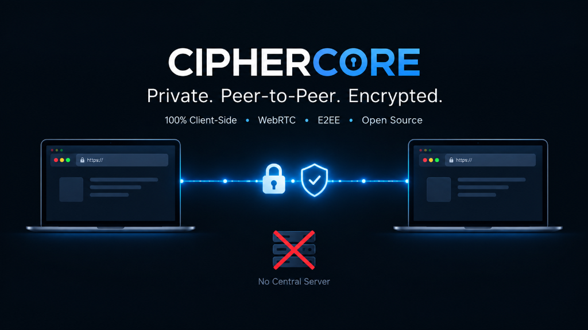

<div align="center">



# 🛡️ CipherCore | Zero-Server End-to-End Encrypted (E2EE) Chat

[](https://github.com/nadeemmhdm/end-to-end-chat)
[](#-educational-purpose-disclaimer)
[](https://chat.qezvo.in/)
[](LICENSE)
[](SECURITY.md)
[](#-architecture)

**Private. Peer-to-Peer. Encrypted.**  
*100% Client-Side • WebRTC DataChannels • Web Crypto API • Open Source*

</div>

---

## ⚠️ Educational Purpose Disclaimer

> [!IMPORTANT]
> **This project is developed strictly for EDUCATIONAL, RESEARCH, AND DEMONSTRATION PURPOSES ONLY.**
>
> - It demonstrates the practical implementation of in-browser cryptographic primitives using the native browser **Web Crypto API (`window.crypto.subtle`)** and serverless peer-to-peer communication via **WebRTC DataChannels**.
> - It is **not** audited by an independent cryptographic verification firm and should **not** be used as a replacement for battle-tested production messaging networks (such as Signal) in life-critical, political dissident, or high-risk operational environments.
> - The authors and contributors assume no liability for misuse, transmission of sensitive data, or security incidents resulting from reliance on this code.
> - See [SECURITY.md](SECURITY.md) for full security policies and responsible disclosure guidelines.

---

## 📖 Open Source Project

This project is proud to be **100% Open Source** under the [MIT License](LICENSE)!

- **Freely Available**: Anyone is free to inspect, fork, modify, learn from, experiment with, and deploy this project.
- **Inspectable Codebase**: No obfuscated code, no hidden backend calls, and no analytics or telemetry scripts. Every cryptographic routine and WebRTC signal is transparently inspectable directly in your browser's Developer Tools.
- **Contributions Welcome**: Feel free to submit pull requests, report issues, or suggest enhancements for educational cryptography demonstrations.

---

## 🌐 Live Demo & GitHub Pages Hosting

### 🌟 Live Demo URL
Experience the live application hosted with custom domain on GitHub Pages:  
👉 **[https://chat.qezvo.in](https://chat.qezvo.in)**

---

## 💻 CLI Commands & Local Development

Because modern browsers enforce **Secure Contexts** (`HTTPS` or `localhost`) to enable the **Web Crypto API** (`window.crypto.subtle`) and WebRTC media devices, opening `index.html` directly as a `file://` URI will restrict cryptographic features. Always serve the project through a local or remote web server.

### 1. Clone the Repository
```bash
# Clone via Git CLI
git clone https://github.com/nadeemmhdm/end-to-end-chat.git

# Enter project directory
cd end-to-end-chat
```

### 2. Run Local Development Server via CLI

Choose any of your preferred CLI tools:

#### Using Python 3 (No dependencies needed)
```bash
# Serves at http://localhost:8080
python -m http.server 8080
```

#### Using Node.js / npx
```bash
# Using 'serve'
npx serve . -p 8080

# Or using 'http-server'
npx http-server -p 8080 -c-1
```

#### Using PHP CLI
```bash
# Serves at http://localhost:8080
php -S localhost:8080
```

Once running, navigate to `http://localhost:8080` in your web browser.

---

### 3. Git Workflow & Maintenance CLI

Common CLI commands used when updating this repository:

```bash
# Check working tree status
git status

# Stage all updates (code, docs, CNAME)
git add .

# Commit your changes
git commit -m "docs: update security policy, license, and custom domain"

# Synchronize with upstream
git pull --rebase origin main

# Push updates to GitHub Pages
git push origin main
```

---

### 4. GitHub CLI (`gh`) Deployment & Management

If you have the [GitHub CLI (`gh`)](https://cli.github.com/) installed:

```bash
# Fork the repository with GitHub CLI
gh repo fork nadeemmhdm/end-to-end-chat --clone

# View current deployment status
gh api repos/:owner/:repo/pages

# Configure GitHub Pages branch via CLI
gh api -X POST repos/:owner/:repo/pages -f source='{"branch":"main","path":"/"}'
```

---

## 🚀 How to Re-Publish on GitHub Pages

Since **CipherCore** is completely serverless and consists purely of static client-side files (`HTML`, `CSS`, `JS`), it is pre-configured for seamless hosting and re-publishing on **GitHub Pages**.

### Method 1: Fork and Enable (Fastest)

1. **Fork the Repository**:
   - Click **Fork** at [https://github.com/nadeemmhdm/end-to-end-chat](https://github.com/nadeemmhdm/end-to-end-chat).
2. **Go to Repository Settings**:
   - In your newly forked repository, click on the **Settings** tab.
3. **Navigate to Pages**:
   - In the left sidebar, locate and click **Pages** (under "Code and automation").
4. **Set Up Build and Deployment**:
   - **Source**: Select `Deploy from a branch`.
   - **Branch**: Select `main` and keep the folder set to `/ (root)`.
   - Click **Save**.
5. **Custom Domain (Optional - e.g., `chat.qezvo.in`)**:
   - In the **Custom domain** field, enter your domain (e.g. `chat.qezvo.in`).
   - GitHub will automatically verify the domain and create a `CNAME` file in your repository.
   - Point your DNS provider's CNAME record for `chat` to `<your-username>.github.io`.
   - Check **Enforce HTTPS**.

---

### Method 2: Clone, Modify, and Push to a New Repository

1. **Clone and prepare**:
   ```bash
   git clone https://github.com/nadeemmhdm/end-to-end-chat.git
   cd end-to-end-chat
   ```

2. **Set your custom domain in `CNAME`**:
   ```bash
   echo "chat.qezvo.in" > CNAME
   ```

3. **Push to your own GitHub repo**:
   ```bash
   git remote set-url origin https://github.com/<your-username>/<your-repo-name>.git
   git add .
   git commit -m "feat: setup personal instance on custom domain"
   git branch -M main
   git push -u origin main
   ```

4. **Enable GitHub Pages & Enforce HTTPS** in repository **Settings** → **Pages**.

---

## 🌟 Key Features

- 🔐 **Zero-Server Architecture**: 100% client-side execution. Zero databases, zero telemetry, and zero centralized message logs.
- 🔑 **CSPRNG 16-Character Password Generation**: Generates cryptographically secure passwords with live Shannon entropy evaluation (~102 bits).
- 🛡️ **Military-Grade Cryptography (Web Crypto API)**:
  - **AES-GCM 256-bit** authenticated encryption with distinct 96-bit random IV per message.
  - **PBKDF2** key derivation with 600,000 rounds of SHA-256 (OWASP compliant).
  - **Ephemeral ECDH (P-256)** key exchange providing **Perfect Forward Secrecy (PFS)**.
- ⏱️ **Self-Destructing / Ephemeral Messages**: Configurable burn timers (10s, 30s, 1m, 5m, 1h) with animated visual countdown progress bars.
- 📁 **E2EE File & Media Transfer**: In-browser chunked AES-GCM file encryption streamed across WebRTC DataChannels.
- 🎙️ **Encrypted Voice Notes**: On-the-fly audio recording and browser-native ciphertext transmission.
- 🔢 **Signal-Style 60-Digit Safety Numbers**: Cryptographic fingerprint blocks for peer identity verification and MITM attack detection.
- 🚨 **Panic Killswitch (`Esc` key or Button)**: Instantly scrubs cryptographic keys from memory, tears down WebRTC sessions, clears the DOM, and redirects to DuckDuckGo.
- 🧮 **Decoy Disguise Mode**: Camouflage calculator disguise with secret unlock code (`1337 =`).
- 🕶️ **Anti-Shoulder-Surfing Blur**: Automatically obscures message content whenever the browser tab or window loses focus.
- 🎨 **Modern Cyber Glassmorphism UI**: High-contrast, responsive layout styled with Boxicons and a 3-way cyber theme switcher (Obsidian Stealth, Cyber Violet, Electric Cyan).

---

## 📂 Project Structure

```
├── CNAME            # GitHub Pages custom domain routing (chat.qezvo.in)
├── index.html       # Primary chat application interface & decoy calculator
├── audit.html       # Cryptographic benchmark test suite & threat model whitepaper
├── manifest.json    # Web App Manifest for PWA installation
├── LICENSE          # MIT Open Source License
├── SECURITY.md      # Security policy and responsible disclosure instructions
├── README.md        # Documentation and deployment guides
├── assets/
│   └── ciphercore-banner.png # Project hero banner
├── css/
│   └── style.css    # Responsive glassmorphic dark mode styling & animations
└── js/
    ├── crypto.js    # Native Web Crypto API wrappers (AES-GCM, PBKDF2, ECDH, SHA-256)
    ├── webrtc.js    # P2P WebRTC DataChannel connection & signaling management
    └── app.js       # Main application logic, UI bindings, and panic triggers
```

---

## 🔒 Security & Cryptographic Benchmark

- Review the full security guidelines and responsible disclosure protocol in [SECURITY.md](SECURITY.md).
- Execute the hardware-accelerated benchmark suite:
  - Online: [https://chat.qezvo.in/audit.html](https://chat.qezvo.in/audit.html)
  - Local file: [audit.html](audit.html)

---

## 📄 License

This project is open source and licensed under the **[MIT License](LICENSE)**.
